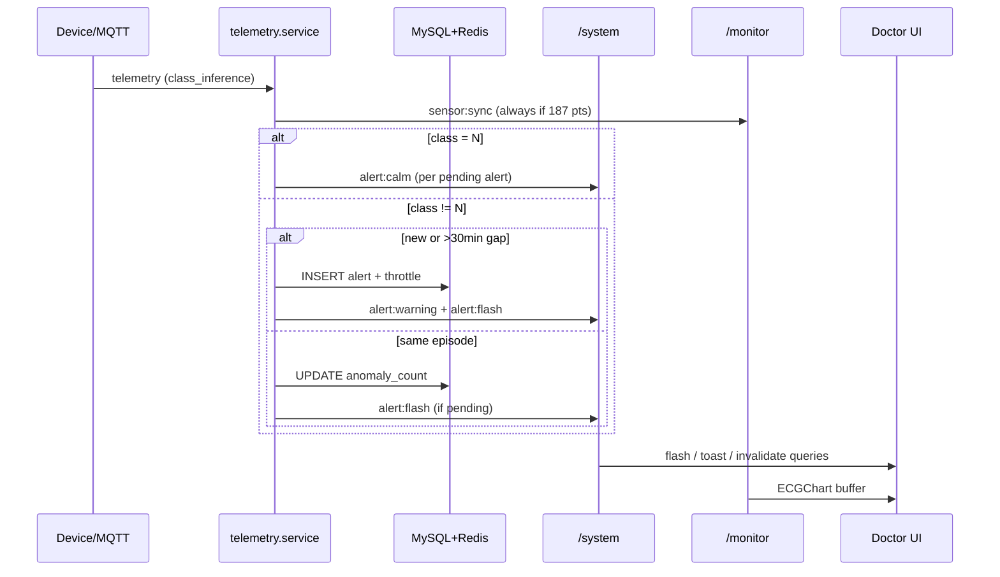

# Tài liệu WebSockets (Socket.IO) — GR2 Telehealth

Quy chuẩn **Namespace**, **Room**, **Event** và luồng dữ liệu thực tế giữa Backend ↔ Frontend.  
Mọi chuỗi event/room phải lấy từ constants — không hard-code.

| Layer              | File constants                             |
| ------------------ | ------------------------------------------ |
| Backend            | `backend/src/sockets/socket.constants.js`  |
| Frontend           | `frontend/src/sockets/socket.constants.ts` |
| Payload types (FE) | `frontend/src/sockets/socket.types.ts`     |

---

## 1. Kiến trúc tổng quan

```
Thiết bị IoT / Simulator (MQTT)
        │
        ▼
  mqtt.client.js  →  telemetry.service.js
        │                    │
        │                    ├── class_inference = N  → /monitor  sensor:sync
        │                    │                         → /system   alert:calm (pending)
        │                    │
        │                    └── class_inference ≠ N  → /monitor  sensor:sync
        │                                              → /system   alert:flash | alert:warning
        │                                              → MySQL + Redis throttle + Email
        │
        ▼
  Socket.IO Server (HTTP + Redis Adapter)
        │
        ├── /system   — presence, alert, appointment, notification, call
        ├── /chat     — tin nhắn (MongoDB)
        └── /monitor  — stream ECG 187 điểm/gói
```

### Hạ tầng

- **Server:** `backend/src/sockets/index.js` — tạo `socketServer`, gắn Redis adapter (`@socket.io/redis-adapter`) để scale nhiều instance.
- **Auth:** JWT trong `handshake.auth.token` — middleware `socket.auth.js` gắn `socket.user` cho cả 3 namespace.
- **Emit từ service:** `getIo()` qua `io.instance.js` — tránh circular import (`emitters/*.js`).
- **Handlers:** `handlers/system.handlers.js`, `chat.handlers.js`, `monitor.handlers.js`.

### Kết nối Frontend

| Namespace  | Store / Hook             | Khi nào connect                                                     |
| ---------- | ------------------------ | ------------------------------------------------------------------- |
| `/system`  | `systemSocket.store.ts`  | Layout bác sĩ / bệnh nhân (global)                                  |
| `/chat`    | `chatSocket.store.ts`    | Trang chat                                                          |
| `/monitor` | `monitorSocket.store.ts` | Chỉ khi có chart ECG (`useMonitorEcgStream`) — tránh tốn tài nguyên |

---

## 2. Namespaces

Hệ thống dùng **3 namespace**:

| Namespace  | Vai trò                                                                   |
| ---------- | ------------------------------------------------------------------------- |
| `/system`  | Online/offline, cảnh báo AI, lịch hẹn, thông báo, signaling cuộc gọi Zego |
| `/chat`    | Tin nhắn realtime (lưu MongoDB)                                           |
| `/monitor` | Stream waveform ECG từ MQTT                                               |

---

## 3. Quy tắc đặt tên Room

Cú pháp: `[phân_loại]:[id]` (chữ thường, dấu `:` phân tách).

Định nghĩa trong `SOCKET_ROOMS` — helper function hoặc chuỗi tĩnh.

| Namespace  | Key constants                | Room                   | Ví dụ                  | Dùng khi                                                               |
| ---------- | ---------------------------- | ---------------------- | ---------------------- | ---------------------------------------------------------------------- |
| `/system`  | `SYSTEM.PERSONAL(userId)`    | `user:{userId}`        | `user:42`              | **Chính:** alert, notification, appointment, call — emit tới từng user |
| `/system`  | `SYSTEM.ROLE(role)`          | `role:{role}`          | `role:doctor`          | _Dự phòng_ — chưa dùng trong emitters hiện tại                         |
| `/system`  | `SYSTEM.GLOBAL`              | `system:global`        | `system:global`        | _Dự phòng_ — broadcast toàn hệ thống                                   |
| `/chat`    | `CHAT.CONVERSATION(id)`      | `conversation:{id}`    | `conversation:abc`     | Chat 1-1 / nhóm                                                        |
| `/monitor` | `MONITOR.PATIENT(patientId)` | `monitor:patient:{id}` | `monitor:patient:7`    | Stream ECG — `patientId` = **user_id** bệnh nhân                       |
| `/monitor` | `MONITOR.DEVICE(deviceId)`   | `monitor:device:{id}`  | `monitor:device:DEV_1` | _Tương lai_                                                            |

### Join room

| Namespace  | Auto-join                       | Client emit                                              |
| ---------- | ------------------------------- | -------------------------------------------------------- |
| `/system`  | Tự `join user:{id}` khi connect | `room:join` — join thêm room tùy chọn (log)              |
| `/chat`    | Không                           | `room:join` → `conversation:{id}` (kiểm tra participant) |
| `/monitor` | Không                           | `room:join` → `monitor:patient:{id}` (kiểm tra ACL)      |

### ACL `/monitor`

- **Bệnh nhân:** chỉ join `monitor:patient:{ownUserId}`.
- **Bác sĩ:** join nếu có quan hệ trong `patient_doctors`.
- Từ chối: server emit `room:join_rejected` (`INVALID_ROOM` | `FORBIDDEN` | `SERVER_ERROR`).

---

## 4. Quy tắc đặt tên Event

Định dạng: `[entity]:[action]` (chữ thường, dấu `:`).

- **Client → Server:** động từ / hành động (`message:send`, `room:join`, `call:invite`).
- **Server → Client:** sự kiện đã xảy ra (`message:new`, `alert:updated`).

Hằng số: `SYSTEM_EVENTS`, `CHAT_EVENTS`, `MONITOR_EVENTS`.

---

## 5. Namespace `/system`

### 5.1. Presence (Redis)

- Key: `presence:user:{userId}` — Set các `socket.id`.
- TTL: 180s; gia hạn mỗi 60s khi socket `/system` còn sống.
- **Online:** lần đầu có socket → `presence:online` tới `user:{relatedId}` (bác sĩ ↔ bệnh nhân liên quan).
- **Offline:** `disconnect` → `SCARD` = 0 → `presence:offline`.

| Event              | Hướng | Payload (tóm tắt) |
| ------------------ | ----- | ----------------- |
| `presence:online`  | S→C   | `{ userId }`      |
| `presence:offline` | S→C   | `{ userId }`      |

### 5.2. Alert (MQTT + MySQL + Redis throttle)

**Nguồn:** `telemetry.service.js` + `alert.service.js`.

| Event           | Hướng | Khi nào                                                               | Payload                                                      |
| --------------- | ----- | --------------------------------------------------------------------- | ------------------------------------------------------------ |
| `alert:warning` | S→C   | **Alert mới** (insert DB + email lần đầu)                             | Object `Alert` đầy đủ (qua `notifyAlertCreated`)             |
| `alert:flash`   | S→C   | Abnormal lặp lại **cùng alert** (pending) hoặc ngay sau tạo mới       | `{ alertId, patientId, type, anomalyCount, lastDetectedAt }` |
| `alert:calm`    | S→C   | ECG **normal** (`class_inference = N`) — mỗi alert **pending** của BN | `{ alertId, patientId, type }`                               |
| `alert:updated` | S→C   | Claim / release / resolve                                             | Object `Alert` cập nhật                                      |

**Room:** `user:{doctorUserId}` — danh sách bác sĩ liên quan bệnh nhân (`patient_doctors`).

**Logic gộp alert (cùng `type`, ví dụ `ecg_V`):**

| Kịch bản                                  | Hành vi                                                                                      |
| ----------------------------------------- | -------------------------------------------------------------------------------------------- |
| Khác `type`                               | Luôn tạo alert mới                                                                           |
| Cùng `type`, `last_detected_at` ≤ 30 phút | Update `anomaly_count`, `last_detected_at`; `alert:flash` (nếu pending)                      |
| Cùng `type`, > 30 phút im lặng            | Tạo alert mới                                                                                |
| Redis throttle                            | Key `alert:throttle:{patientId}:{type}` — TTL 30 phút, **refresh** mỗi lần ghi nhận abnormal |

**Frontend (bác sĩ — `DoctorLayout`):**

- `alert:flash` → nháy đỏ (cooldown 3s/alert, duration 1.2s).
- `alert:calm` → reset cooldown (cho phép nháy lại khi abnormal tiếp).
- `alert:updated` + `handling` / `resolved` → dừng nháy vĩnh viễn alert đó.

### 5.3. Appointment & Notification

| Event                              | Hướng | Mô tả                                           |
| ---------------------------------- | ----- | ----------------------------------------------- |
| `appointment:created`              | S→C   | Lịch hẹn mới → `user:{id}` từng người liên quan |
| `appointment:updated`              | S→C   | Cập nhật trạng thái lịch                        |
| `notification:new`                 | S→C   | Thông báo hệ thống                              |
| `notification:read`                | C↔S   | Đánh dấu đã đọc                                 |
| `notification:unread_count_update` | S→C   | `{ count }` — badge                             |

### 5.4. Telehealth call (Zego — trên `/system`)

Signaling qua socket; media qua Zego SDK.

| Event           | Hướng     | Mô tả                                                                                                              |
| --------------- | --------- | ------------------------------------------------------------------------------------------------------------------ |
| `call:invite`   | C→S       | Người gọi gửi — validate conversation, callLog, quyền                                                              |
| `call:incoming` | S→C       | Tới `user:{peerUserId}` — `{ conversationId, zegoRoomId, callLogId, initiatorUserId, appointmentId?, fromAlert? }` |
| `call:accept`   | C→S / S→C | Người nhận accept → notify caller                                                                                  |
| `call:reject`   | C→S / S→C | Từ chối → notify caller                                                                                            |
| `call:end`      | C→S / S→C | Kết thúc → notify peer                                                                                             |

### 5.5. Room join tùy chọn

| Event       | Hướng | Mô tả                                                     |
| ----------- | ----- | --------------------------------------------------------- |
| `room:join` | C→S   | Client gửi tên room bổ sung (ngoài auto-join `user:{id}`) |

---

## 6. Namespace `/chat`

| Event                | Hướng | Mô tả                                              |
| -------------------- | ----- | -------------------------------------------------- |
| `room:join`          | C→S   | Join `conversation:{id}` — bắt buộc là participant |
| `room:join_rejected` | S→C   | `INVALID_ROOM` \| `NOT_PARTICIPANT`                |
| `room:leave`         | C→S   | Rời phòng                                          |
| `message:send`       | C→S   | Gửi tin — lưu MongoDB                              |
| `message:new`        | S→C   | Broadcast trong conversation                       |
| `message:read`       | C→S   | Đánh dấu đã đọc                                    |
| `typing:start`       | C→S   | Đang gõ                                            |
| `typing:stop`        | C→S   | Ngừng gõ                                           |

---

## 7. Namespace `/monitor`

### 7.1. Luồng dữ liệu MQTT → Socket

1. Broker publish topic (env `MQTT_TOPIC`, ví dụ `+/server`).
2. `processTelemetryMessage` — `content === 'telemetry'`.
3. Resolve `device.id` → `patientId` (user_id BN).
4. **Mọi** gói hợp lệ (`packet_ecg` length 187) → `emitEcgPacketToPatientMonitor`.

| Event                | Hướng | Payload                                                                             |
| -------------------- | ----- | ----------------------------------------------------------------------------------- |
| `sensor:sync`        | S→C   | `{ patientId, deviceId, packetEcg[187], classInference, timeInference, timestamp }` |
| `room:join`          | C→S   | `monitor:patient:{patientId}`                                                       |
| `room:leave`         | C→S   | Rời phòng                                                                           |
| `room:join_rejected` | S→C   | Lý do từ chối                                                                       |

**Lưu ý:** Stream ECG chạy cho cả **normal** và **abnormal** để chart không bị đứt khi có cảnh báo.

---

## 8. Sơ đồ luồng Alert + Monitor (tóm tắt)



---

## 9. Cấu trúc thư mục Backend

```
backend/src/sockets/
├── index.js              # Khởi tạo IO + Redis adapter + đăng ký handlers
├── io.instance.js        # Singleton getIo / setIo
├── socket.auth.js        # JWT middleware
├── socket.constants.js   # SOCKET_ROOMS, *_EVENTS
├── handlers/
│   ├── system.handlers.js
│   ├── chat.handlers.js
│   └── monitor.handlers.js
└── emitters/
    ├── system.emitters.js
    ├── chat.emitters.js
    └── monitor.emitters.js
```

---

## 10. Best practices

1. **Không hard-code** event/room — dùng `socket.constants.js` / `socket.constants.ts`.
2. **Emit qua emitters** từ service layer, không gọi `io` trực tiếp rải rác.
3. **Presence:** chỉ emit `offline` khi `SCARD(presence:user:{id}) === 0` (đa tab).
4. **Monitor:** luôn validate join server-side; không tin client gửi `patientId` tùy ý.
5. **Alert flash** chỉ khi `status === 'pending'`; claim/resolve → `alert:updated`, FE dừng nháy.
6. **FE monitor:** connect lazy theo page có chart; disconnect khi unmount.

---

## 11. Tham chiếu nhanh — Alert events

| FE cần             | Event           | Ghi chú                        |
| ------------------ | --------------- | ------------------------------ |
| Toast + list mới   | `alert:warning` | Có email lần đầu               |
| Nháy màn hình      | `alert:flash`   | Lặp abnormal, không insert mới |
| Reset nháy (ECG N) | `alert:calm`    | Alert vẫn pending              |
| Cập nhật bảng      | `alert:updated` | handling / resolved / release  |

Constants backend: `ALERT_NEW` → `'alert:warning'` (tên event legacy, giữ để không breaking FE).
